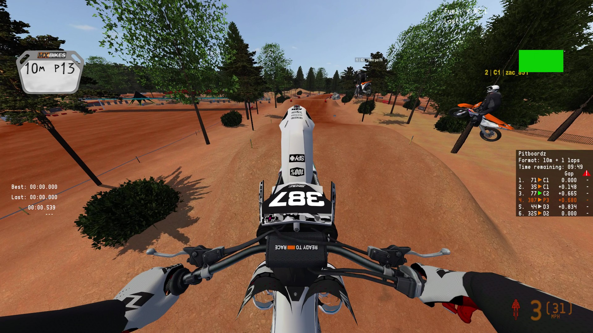
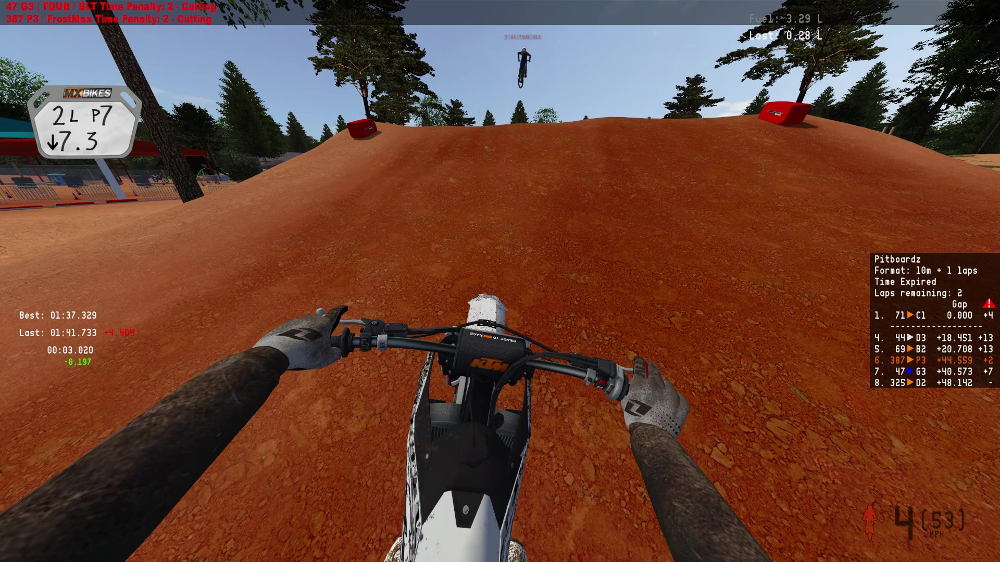
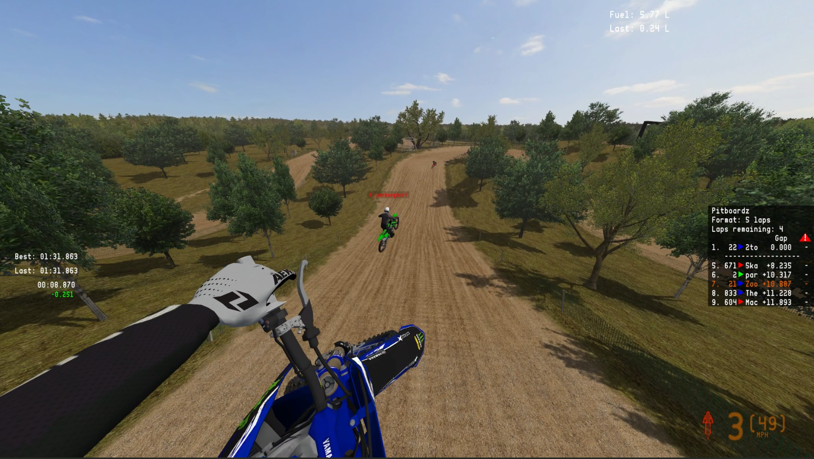
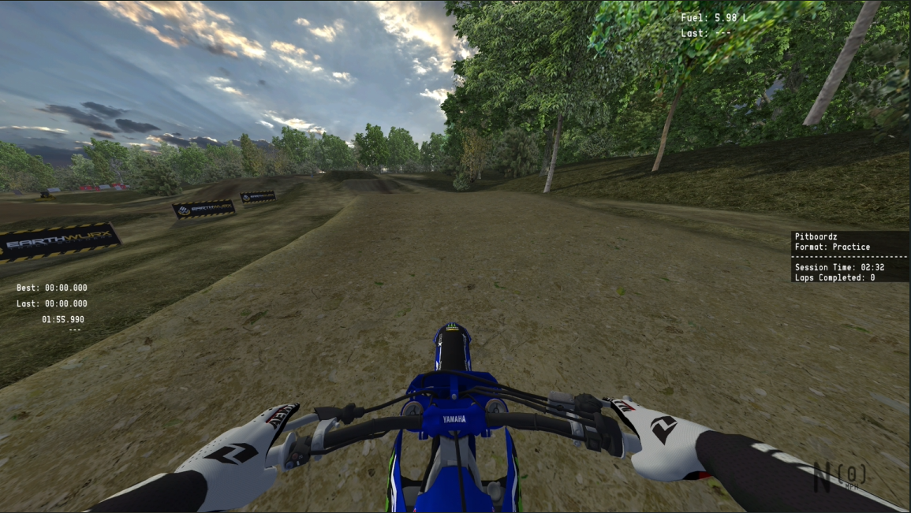

# Pitboardz

Pitboardz is a minimal HUD plugin for [MX Bikes](https://www.mx-bikes.com/) that puts useful race and bike data on screen without crowding the view.

## Features

### Leaderboard

The leaderboard keeps the race format and remaining time or laps visible while you ride. Time gaps come directly from the game and display to the thousandth of a second.

Rider order includes accumulated penalties, matching the positions reported by MX Bikes. The warning column shows penalties for every rider, with your row highlighted in orange. Manufacturer-colored markers beside each race number make bikes easier to identify at a glance.

To keep the list compact, Pitboardz always shows the leader along with the two riders ahead of you and the two behind you.

In lap-only races, the panel shows the number of laps remaining instead of a countdown.

### Stopwatch

The stopwatch displays your best lap, last valid lap, and current lap time. A live delta compares your current progress with your best lap. Green means you are ahead; red means you are behind.

### Speedometer

The speedometer shows the current gear and speed. You can choose MPH or KPH in the configuration file.

### Fuel tracking

Fuel tracking shows the fuel remaining in liters and how much fuel you used on your last valid lap.

### Testing mode

In testing mode, the leaderboard panel drops race-only information. A session timer tracks how long you have been on track since your last pit, and the panel also shows your completed laps.

## Installation

Follow the [step-by-step installation guide](Pitboardz-Install-Instructions.pdf).

## Configuration

Each HUD element can be enabled, disabled, resized, and repositioned in `pitboardz.ini`. The speedometer can also switch between MPH and KPH.

See [Pitboardz - How to Use](<Pitboardz - How to Use.pdf>) for configuration instructions.

## Videos

- [Pitboardz gameplay lap 1](https://youtu.be/0SJCWzdtj6w)
- [Pitboardz gameplay lap 2](https://youtu.be/loAQjvVuf4o)

## About the project

Pitboardz is a solo-developed passion project built for the MX Bikes community. The source is public so other developers can learn from it or use it as a starting point for their own plugins.

Feedback and feature ideas are welcome through [GitHub Issues](https://github.com/MaximusTrue/Pitboardz-Public/issues).

## License

See the [LICENSE](LICENSE) file.
